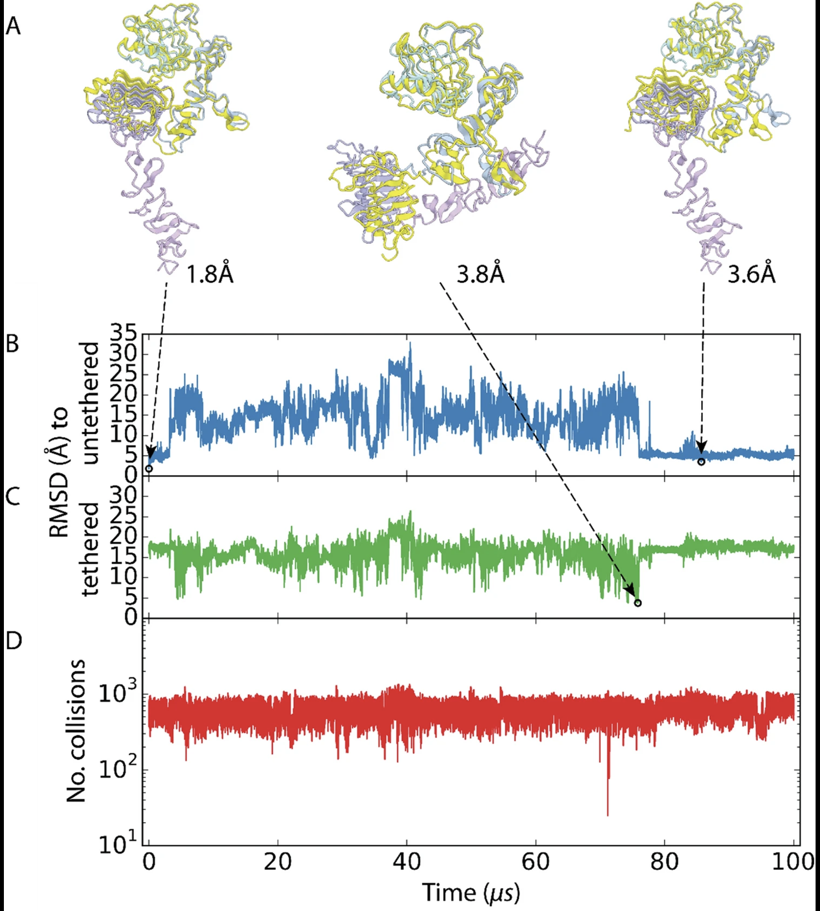

# 2. Scopes and Limitations

## 2.1 What we can simulate

Basically all noncovalent interactions

## 2.2 What we cannot simulate

### 2.2.1 Covalent bond breaking or forming

So basically any biochemical interaction that involves covalent bond
breaking or forming is beyond the reach of classical molecular dynamics.

There is a way around this — treating a small region of the system
quantum-mechanically instead, which GROMACS supports through its QM/MM
interface. It is far more expensive, so it is reserved for the few atoms
where the chemistry actually happens. Neural network potentials, which we
will come to later, are opening a second route.

Fortunately, the great majority of biochemical interactions in nature are
non-covalent, and those our simulations handle very well.

### 2.2.2 Spatial pH gradient

In standard MD: protonation states are set once at setup and frozen. A
histidine that should flip stays put for the whole run.

However, pH-dependent protonation state changes can be captured through
a workaround in modern techniques such as constant-pH MD (CpHMD). But
even then we can’t achieve spatial ph gradient, say we want the ph
between two sides of a membrane to differ, we cannot do that.

### 2.2.3 Polarizable electron cloud (we are stuck with fixed charges)

In MD simulations, every atom carries a fixed charge sitting at the
centre of a sphere. In reality an atom is more like a shifting blob of
electron cloud around a nucleus, and that cloud moves in response to
whatever charges are nearby.

{{INTERACTIVE: polarizability-explainer}}

The limitation is not really the shape — it is that the charge never
changes. The partial charge on an oxygen is exactly the same whether
that oxygen sits in bulk water or squeezed next to a metal ion. Real
electrons would redistribute; ours cannot.

Fixed-charge force fields work around this by using charges tuned for an
average watery environment. That is why they perform well in solution
and less well in unusual surroundings — buried protein interiors, ion
binding sites, membranes, and the crowded negative environment around
DNA.

Polarizable models that let the charge respond do exist, and GROMACS
supports them through what are called Drude or shell particles. The
catch is cost: they need a smaller timestep and more work per step,
making them roughly four times more expensive. They are also still being
refined, so fixed-charge force fields remain the default for almost
everything.

It is worth knowing what we are giving up, though. In 2025, simulations
using polarizable models managed for the first time to reproduce the
potassium currents actually measured through ion channels in experiments
— something fixed charges could not do. So this is a real limitation
with a real cost, not just a technical footnote.

### 2.2.4 Realistic timescale scope

Most biochemical processes of interest unfold over microseconds to
milliseconds — and even seconds. Yet on a typical single-GPU
workstation, a 5–10 µs run of a modestly sized solvated system can take
weeks. This is why you'll find many published studies reporting 200–1000
ns runs as sufficient — though what counts as "enough" is entirely
context-dependent. (Only specialised hardware, like the purpose-built
Anton supercomputer, reaches the millisecond regime in a single
continuous run.)

<figure markdown="1">
{ width="100%" }
<figcaption>
<strong>Figure 1.</strong> Some molecular dynamics simulations show interesting
results as late as 80 microseconds, as shown here.
<em>Source: Cancer Discovery, vol. 14, no. 2, 2024, pp. 240–257.</em>
</figcaption>
</figure>

There is, however, one silver lining and one workaround.

The silver lining is resolution. Because MD integrates motion in
femtosecond steps, we capture fast atomic motions in complete detail —
side chains rotating, hydrogen bonds forming and breaking, water
rearranging around the surface. Although we cannot capture slower
biochemical processes — such as the full response of a large biomolecule
like a G protein–coupled receptor upon ligand binding — we can obtain a
highly detailed picture of the earliest stages of a biomolecular event.
For instance, we can closely examine the first few nanoseconds of a
process, including the first signs of local destabilisation caused by a
mutation.

The workaround is enhanced sampling. Rather than waiting for a rare,
slow event to happen on its own, these methods bias the simulation to
reach the answer far more cheaply — most often the thermodynamics
(free-energy differences, relative populations, binding affinities)
rather than the literal real-time trajectory.

## 2.3 So why bother?

MD simulation has real limitations — and we have been honest about all
of them. But here is the thing: a flawed tool, used thoughtfully, is
still enormously useful.

The key is comparison. When we simulate a wild-type protein and a
mutant, both runs carry the exact same approximations — the same force
field, the same timescale constraints, the same fixed charges. The maths
is wrong in the same way for both. So when we see a difference between
them, that difference is meaningful, even if neither simulation is a
perfect portrait of what happens inside a cell.

The same logic drives the drug discovery use of MD. Take one target
protein and simulate it with several candidate compounds bound —
different leads from a screening campaign, or a series of chemically
related molecules from a medicinal chemistry programme. Every run shares
the same errors, so the **ranking** between them survives even though no
individual number is exactly right. Which ligand holds its pose, which
one keeps its key contacts, which one slips out of the pocket — these
comparisons are where MD earns its place in a real project.

That is the principle underlying almost everything in this workshop:
**absolute numbers from MD deserve caution, but differences between
carefully matched simulations are trustworthy**.

## 2.4 So what can we do?

Molecular dynamics gives us a remarkably broad window into biomolecular
behaviour. The systems we can simulate fall into a few core categories.

### 2.4.1 Stability and folding

We can watch a lone biomolecule — or one embedded in a membrane — and
ask whether it retains its native fold over time, how it unfolds under
stress, or, for small fast-folding proteins and with help from the
enhanced sampling methods mentioned above, how it folds in the first
place.

{{VIDEO: protein-folding}}

### 2.4.2 Binding

When two or more biomolecules come together, we can characterise nearly
every aspect of the interaction: where they bind, how strongly they
bind, how the binding affinity is distributed across residues, and how
long the complex remains intact. Just as importantly, we can capture the
conformational changes that ripple outward from the binding event —
often the most biologically meaningful part of the story.

This is also where the comparative approach pays off most directly.
Simulating the same target with several different candidate ligands,
under identical conditions, lets us rank them against each other and see
which interactions each one actually relies on.

{{VIDEO: fgfr1-compound6}}

{{VIDEO: fgfr2-compound6}}

### 2.4.3 Range of molecule types

The biomolecules involved are not restricted to any one class. Proteins,
DNA, RNA, lipids, small-molecule ligands, ions, cofactors — any of these
can serve as a partner in the system we set up.

### 2.4.4 Modulating conditions

For each of these phenomena, we can systematically vary the environment:
temperature, ionic strength, solvent composition, pressure, and pH
(using the constant-pH methods mentioned earlier). This lets us compare
how the same biomolecule behaves under physiological conditions versus
stress, or how a drug binds at acidic versus neutral pH.

{{VIDEO: sso7d-365k}}

{{VIDEO: sso7d-400k}}

### 2.4.5 Modifying the biomolecule itself

Alternatively, we can keep conditions constant and instead change the
molecule: point mutations, insertions, deletions, or post-translational
modifications. Then we ask how those changes affect stability, folding,
binding, or downstream conformational dynamics.

This is where MD becomes especially powerful for disease research —
comparing wild type to a clinically relevant mutant under identical
conditions isolates the structural consequences of that single change.
The same design serves drug discovery from the other direction: hold the
protein fixed and vary the ligand instead, comparing lead compounds
against one target, or checking whether a resistance mutation weakens a
drug's grip.

### 2.4.6 Kinetics and timescales

Beyond the *what*, we can also ask *how fast* — though this is the
most demanding thing to extract, since the interesting rates (folding,
dissociation, large rearrangements) are usually slower than a single
simulation can reach.

Fast events that fall inside the accessible window can be timed
directly. For the slow ones, we do not watch a single long trajectory;
instead we run many short ones and stitch them together statistically
(Markov State Models), or use specialised rare-event methods such as
weighted ensemble that recover rate constants without waiting for the
event in real time.

Either way, comparative kinetic analysis — wild type against mutant, or
one candidate compound against another — turns these into quantitative
measurements. For a drug, how long it stays bound can matter as much as
how tightly it binds, since the two are related but not the same thing.

So all we do is look at simulation videos? Absolutely not. We will get
into the analytics — but first we need to run the simulations, and
before that, we need to set the stage.

---

[← What is an MD simulation](01-basics.md) &nbsp;·&nbsp; [Running a simulation →](03-running-a-simulation.md)
